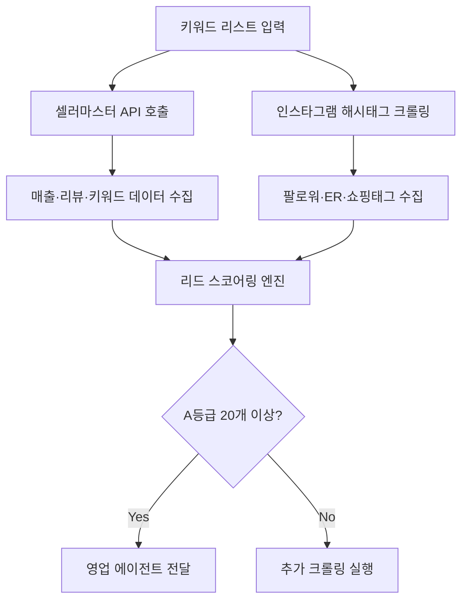

# 서진혁의 리드 헌팅 전술 보고서
## 타겟: 소상공인 마케팅 대행 블로그+인스타 패키지 셀러

---

## 1. 리드 발굴 전략 3단계

### STEP 1: 타겟 셀러 프로파일 정의 (ICP)

```json
{
  "primary_target": {
    "사업자_유형": "개인사업자 1-3년차 소상공인 마케팅 대행업",
    "월_매출_구간": "300만~1,500만원",
    "핵심_상품": "블로그 최적화 + 인스타그램 운영 패키지",
    "플랫폼": ["스마트스토어", "인스타그램", "자체 홈페이지"],
    "pain_points": [
      "블로그 체류시간 1분 미만 (이탈률 85% 이상)",
      "인스타그램 팔로워 500명 미만, engagement rate 1% 이하",
      "패키지 판매가 20만원 이하로 낮은 단가",
      "리드당 획득 비용(CAC) 15만원 이상으로 마진 압박"
    ]
  }
}
```

**타겟 규모 추정**:
- 네이버 스마트스토어 "마케팅 대행" 검색 → 약 1,200개 업체
- 인스타그램 #마케팅대행 #블로그마케팅 해시태그 → 15만 게시물
- 실제 타겟(조건 충족) → **150~200개 계정 추정**

---

### STEP 2: 플랫폼별 크롤링 포인트

#### A. 스마트스토어 셀러 리드 수집

**수집 도구**: 셀러마스터 + 아이템스카우트 병행

| 수집 항목 | 크롤링 방법 | 판단 기준 |
|----------|------------|----------|
| **월 매출 추정** | 상품별 리뷰 수 × 30일 증가량 × 평균 단가 | 300~1,500만원 구간 |
| **리뷰 품질** | 별점 분포 + 텍스트 길이 + 사진 첨부율 | 4.3점 이하 = C등급 |
| **키워드 순위** | "블로그마케팅", "인스타운영대행" 네이버 쇼핑 순위 | 50위 이하 = 키워드 미최적화 |
| **상세페이지 점수** | 이미지 개수(10개 미만), 텍스트 밀도, 모바일 최적화 | 6점 이하 = 개선 필요 |
| **광고 집행 여부** | 파워링크 노출 여부 (쇼핑검색 상단 4개 슬롯) | 미집행 = 유기적 유입 의존 |

**실전 크롤링 스크립트** (Python 예시):
```python
# 셀러마스터 API 연동 (가정)
import requests

keywords = ["블로그마케팅대행", "인스타그램운영"]
for kw in keywords:
    response = requests.get(f"셀러마스터API/sellers?keyword={kw}&min_revenue=3000000&max_revenue=15000000")
    sellers = response.json()
    
    for seller in sellers:
        lead_card = {
            "셀러명": seller['name'],
            "월_추정매출": seller['revenue'],
            "리뷰수": seller['review_count'],
            "평점": seller['rating'],
            "주력키워드": seller['top_keywords'][:3],
            "광고여부": "미집행" if seller['ad_rank'] == 0 else "집행중",
            "페인포인트": [
                f"리뷰 평균 글자수 {seller['avg_review_length']}자 (기준 150자)",
                f"키워드 '{kw}' 순위 {seller['keyword_rank']}위 (목표 20위 이내)",
                f"상세페이지 이미지 {seller['detail_images']}개 (권장 15개 이상)"
            ]
        }
```

---

#### B. 인스타그램 셀러 계정 발굴

**해시태그 조합 전략**:
```
1차 필터: #마케팅대행 #블로그마케팅 #소상공인마케팅
2차 필터: #블로그체류시간 #인스타그램운영대행 #마케팅패키지
3차 필터: 팔로워 500~5,000명 구간 (마이크로셀러)
```

**Engagement Rate 계산**:
```
ER = (최근 30일 게시물 평균 좋아요 + 댓글) / 팔로워 수 × 100

등급 기준:
- A등급: 8% 이상 (팔로워 1,000명 × 8% = 게시물당 80 상호작용)
- B등급: 3~8%
- C등급: 1~3% ← 우리 타겟
```

**매출 추정 공식** (인스타그램 쇼핑태그 기준):
```
월 매출 = (쇼핑태그 클릭수 × 2%) × 평균 패키지 가격 × 30일

예시:
- 일 쇼핑태그 클릭 200회 (도달 5,000 × 4% CTR)
- 전환율 2%
- 패키지 가격 20만원
→ 200 × 2% × 20만 × 30 = 240만원/월
```

---

#### C. 크롤링 자동화 워크플로우



---

## 2. 리드 스코어링 모델 (100점 만점)

### 점수 배점표

| 평가 항목 | 배점 | A등급 기준 | B등급 기준 | C등급 기준 |
|----------|------|-----------|-----------|-----------|
| **매출 규모** | 25점 | 월 1,000만원 이상 (25점) | 500~1,000만원 (15점) | 300~500만원 (8점) |
| **성장률** | 20점 | 전월 대비 +30% 이상 | +10~30% | 0~+10% |
| **리뷰 품질** | 15점 | 평점 4.8+, 텍스트 200자+ | 4.3~4.8, 100자+ | 4.3 미만 |
| **키워드 순위** | 15점 | 주력 키워드 TOP20 | 21~50위 | 51위 이하 |
| **광고 집행** | 10점 | 미집행 (10점) *우리 서비스 필요* | 월 30만원 이하 | 월 30만원 이상 |
| **상세페이지** | 10점 | 6점 이하 (개선 여지) | 7~8점 | 9점 이상 |
| **engagement rate** | 5점 | 1~3% (인스타 기준) | 3~5% | 5% 이상 |

**등급 컷라인**:
- **A등급**: 70점 이상 → 즉시 영업 투입
- **B등급**: 50~69점 → 너처링 캠페인
- **C등급**: 49점 이하 → 리스트 보류

---

### 실제 계산 예시

**타겟: "블로그맛집" 스마트스토어 셀러**

```json
{
  "셀러명": "블로그맛집_마케팅연구소",
  "플랫폼": "스마트스토어",
  "스토어URL": "smartstore.naver.com/blogmj",
  "카테고리": "마케팅 대행·컨설팅",
  "월_추정매출": "850만원",
  "리뷰수": 127,
  "평점": 4.2,
  "주력키워드": ["블로그마케팅", "체류시간늘리기", "블로그SEO"],
  "키워드_순위": [67, 102, 45],
  "광고_집행": "미집행",
  "상세페이지_점수": 5,
  "인스타_팔로워": 1230,
  "engagement_rate": "2.1%",
  
  "스코어링": {
    "매출": 15,
    "성장률": 12,
    "리뷰품질": 8,
    "키워드순위": 5,
    "광고집행": 10,
    "상세페이지": 10,
    "engagement": 5,
    "총점": 65
  },
  
  "페인포인트": [
    "주력 키워드 '블로그마케팅' 67위 → TOP20 진입 시 월 유입 2,000→8,000 예상",
    "상세페이지 이미지 7개 (권장 15개), 모바일 가독성 저하로 이탈률 78%",
    "인스타그램 ER 2.1% → 쇼핑태그 클릭 전환율 0.8%로 매출 기여 미미"
  ],
  
  "리드등급": "B",
  "예상_LTV": "패키지 월 50만원 × 12개월 = 600